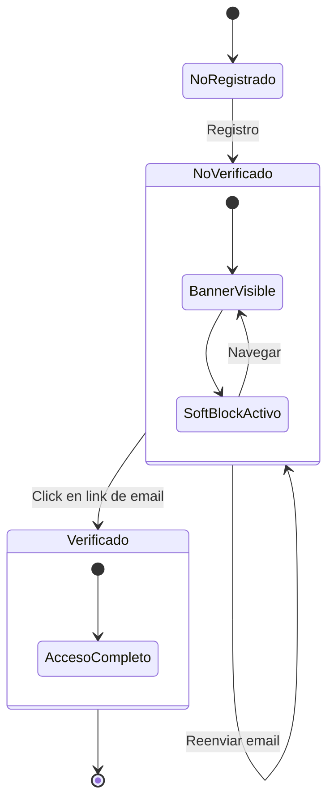

# Citro Web 2.0 - Email Verification Flow (Brevo)

## Sistema de Verificación de Email

### Objetivo

Validar la identidad de usuarios mediante verificación de email, implementando un sistema de "Soft Block" que permite navegación pero restringe acciones sensibles hasta completar la verificación.

---

## Arquitectura del Sistema

```
┌─────────────────────────────────────────────────────────────┐
│                    REGISTRO DE USUARIO                       │
└──────────────────────┬──────────────────────────────────────┘
                       │
                       ▼
┌─────────────────────────────────────────────────────────────┐
│  1. Crear Usuario en DB                                      │
│     - username, password (hashed)                            │
│     - tokens: 100                                            │
│     - emailVerified: false                                   │
│     - verificationToken: crypto.randomBytes(32).hex()        │
│     - lastVerificationSent: now()                            │
└──────────────────────┬──────────────────────────────────────┘
                       │
                       ▼
┌─────────────────────────────────────────────────────────────┐
│  2. Enviar Email de Verificación (Brevo API)                 │
│     - Destinatario: email del usuario                        │
│     - Asunto: "Verifica tu cuenta - Citronella Club"        │
│     - Contenido: HTML con link de verificación              │
│     - Link: FRONTEND_URL/verify-email?token={token}         │
└──────────────────────┬──────────────────────────────────────┘
                       │
                       ▼
┌─────────────────────────────────────────────────────────────┐
│  3. Usuario Hace Login                                       │
│     - Genera JWT con emailVerified: false                    │
│     - Respuesta incluye needsVerification: true              │
└──────────────────────┬──────────────────────────────────────┘
                       │
                       ▼
┌─────────────────────────────────────────────────────────────┐
│  4. Frontend Muestra Banner de Verificación                  │
│     - Visible en todas las páginas                           │
│     - Botón "Reenviar Email"                                 │
│     - Mensaje: "Cuenta pendiente de verificación"            │
└──────────────────────┬──────────────────────────────────────┘
                       │
                       ▼
┌─────────────────────────────────────────────────────────────┐
│  5. Usuario Navega (Soft Block Activo)                       │
│     - ✅ Puede ver productos, posts, eventos                 │
│     - ❌ No puede publicar, comentar, reservar               │
│     - Mensaje: "Debes verificar tu email para..."           │
└──────────────────────┬──────────────────────────────────────┘
                       │
                       ▼
┌─────────────────────────────────────────────────────────────┐
│  6. Usuario Hace Click en Link de Email                      │
│     - GET /api/auth/verify/:token                            │
└──────────────────────┬──────────────────────────────────────┘
                       │
                       ▼
┌─────────────────────────────────────────────────────────────┐
│  7. Backend Valida Token                                     │
│     - Busca user con verificationToken                       │
│     - Si existe:                                             │
│       * emailVerified = true                                 │
│       * verificationToken = null                             │
│     - Si no existe: Error 400                                │
└──────────────────────┬──────────────────────────────────────┘
                       │
                       ▼
┌─────────────────────────────────────────────────────────────┐
│  8. Enviar Email de Bienvenida (Brevo API)                   │
│     - Asunto: "¡Bienvenido a Citronella Club!"              │
│     - Contenido: Confirmación de verificación               │
└──────────────────────┬──────────────────────────────────────┘
                       │
                       ▼
┌─────────────────────────────────────────────────────────────┐
│  9. Usuario Actualiza Sesión                                 │
│     - Banner desaparece                                      │
│     - Soft blocks removidos                                  │
│     - Acceso completo al sistema                             │
└─────────────────────────────────────────────────────────────┘
```

---

## Componentes del Sistema

### 1. Backend - mailService.js

**Ubicación**: `server/services/mailService.js`

**Funciones Principales**:

#### `generateVerificationToken()`

```javascript
const crypto = require('crypto');

function generateVerificationToken() {
    return crypto.randomBytes(32).toString('hex');
}
```

**Características**:

- Genera token único de 64 caracteres hexadecimales
- Criptográficamente seguro
- Almacenado en `User.verificationToken`

---

#### `sendVerificationEmail(email, username, token)`

```javascript
async function sendVerificationEmail(email, username, token) {
    const verificationUrl = `${process.env.FRONTEND_URL}/verify-email?token=${token}`;
    
    const htmlContent = `
        <!DOCTYPE html>
        <html>
        <body style="background: #0d1117; color: #c9d1d9;">
            <div style="max-width: 600px; margin: 40px auto; background: #161b22; padding: 40px; border-radius: 8px;">
                <h1 style="color: #58a6ff;">🌿 Citronella Club</h1>
                <h2>¡Bienvenido, ${username}!</h2>
                <p>Para completar tu registro, verifica tu email:</p>
                <a href="${verificationUrl}" style="background: #2ea043; color: white; padding: 12px 24px; text-decoration: none; border-radius: 6px; display: inline-block;">
                    Verificar mi Email
                </a>
                <p>Este enlace expirará en 24 horas.</p>
            </div>
        </body>
        </html>
    `;
    
    await axios.post('https://api.brevo.com/v3/smtp/email', {
        sender: {
            name: 'Citronella Club',
            email: process.env.BREVO_SENDER_EMAIL
        },
        to: [{ email }],
        subject: 'Verifica tu cuenta - Citronella Club',
        htmlContent
    }, {
        headers: {
            'api-key': process.env.BREVO_API_KEY,
            'content-type': 'application/json'
        }
    });
}
```

---

#### `sendWelcomeEmail(email, username)`

```javascript
async function sendWelcomeEmail(email, username) {
    const htmlContent = `
        <h1>🎉 ¡Cuenta Verificada!</h1>
        <p>Hola, ${username}!</p>
        <p>Tu cuenta ha sido verificada exitosamente.</p>
        <ul>
            <li>🌱 Gestión de cultivos hidropónicos</li>
            <li>🛒 Marketplace de intercambio</li>
            <li>💬 Foro de la comunidad</li>
            <li>🎫 Eventos exclusivos</li>
        </ul>
    `;
    
    await sendEmail({
        to: email,
        subject: '¡Bienvenido a Citronella Club! 🌿',
        htmlContent
    });
}
```

---

### 2. Backend - authController.js

#### Endpoint: `POST /api/auth/register`

```javascript
exports.register = async (req, res) => {
    const { username, password, email } = req.body;
    
    const hash = await bcrypt.hash(password, 10);
    const verificationToken = generateVerificationToken();
    
    const user = await prisma.user.create({
        data: {
            username,
            password: hash,
            email: email || `${username}@temp.citronella.club`,
            tokens: 100,
            verificationToken,
            lastVerificationSent: new Date()
        }
    });
    
    // Enviar email (no bloqueante)
    if (email) {
        sendVerificationEmail(email, username, verificationToken).catch(err => {
            console.error('[EMAIL] Error:', err.message);
        });
    }
    
    const token = jwt.sign({ id: user.id, role: user.role, isDev: user.isDev }, process.env.JWT_SECRET);
    
    res.json({
        token,
        id: user.id,
        username: user.username,
        tokens: user.tokens,
        role: user.role,
        isDev: user.isDev,
        emailVerified: user.emailVerified,
        needsVerification: !user.emailVerified
    });
};
```

---

#### Endpoint: `POST /api/auth/login`

```javascript
exports.login = async (req, res) => {
    const { username, password } = req.body;
    
    const user = await prisma.user.findUnique({ where: { username } });
    if (!user) return res.status(400).json({ error: 'Usuario no encontrado' });
    
    const validPass = await bcrypt.compare(password, user.password);
    if (!validPass) return res.status(400).json({ error: 'Contraseña incorrecta' });
    
    const token = jwt.sign({ id: user.id, role: user.role, isDev: user.isDev }, process.env.JWT_SECRET);
    
    res.json({
        token,
        id: user.id,
        username: user.username,
        tokens: user.tokens,
        role: user.role,
        isDev: user.isDev,
        emailVerified: user.emailVerified,
        needsVerification: !user.emailVerified  // ✅ Flag para frontend
    });
};
```

---

#### Endpoint: `POST /api/auth/resend-verification`

```javascript
exports.resendVerification = async (req, res) => {
    const user = await prisma.user.findUnique({
        where: { id: req.user.id }
    });
    
    if (user.emailVerified) {
        return res.status(400).json({ error: 'El email ya está verificado' });
    }
    
    // Rate limiting: 5 minutos
    if (user.lastVerificationSent) {
        const timeSinceLastEmail = Date.now() - new Date(user.lastVerificationSent).getTime();
        const fiveMinutes = 5 * 60 * 1000;
        
        if (timeSinceLastEmail < fiveMinutes) {
            const remainingTime = Math.ceil((fiveMinutes - timeSinceLastEmail) / 1000 / 60);
            return res.status(429).json({
                error: `Por favor espera ${remainingTime} minuto(s) antes de solicitar otro email`
            });
        }
    }
    
    const newToken = generateVerificationToken();
    
    await prisma.user.update({
        where: { id: user.id },
        data: {
            verificationToken: newToken,
            lastVerificationSent: new Date()
        }
    });
    
    await sendVerificationEmail(user.email, user.username, newToken);
    
    res.json({ message: 'Email de verificación enviado' });
};
```

---

#### Endpoint: `GET /api/auth/verify/:token`

```javascript
exports.verifyEmail = async (req, res) => {
    const { token } = req.params;
    
    const user = await prisma.user.findUnique({
        where: { verificationToken: token }
    });
    
    if (!user) {
        return res.status(400).json({ error: 'Token de verificación inválido o expirado' });
    }
    
    if (user.emailVerified) {
        return res.status(400).json({ error: 'El email ya está verificado' });
    }
    
    await prisma.user.update({
        where: { id: user.id },
        data: {
            emailVerified: true,
            verificationToken: null
        }
    });
    
    // Enviar email de bienvenida (no bloqueante)
    sendWelcomeEmail(user.email, user.username).catch(err => {
        console.error('[EMAIL] Error:', err.message);
    });
    
    res.json({ message: 'Email verificado exitosamente' });
};
```

---

### 3. Frontend - AuthContext.jsx

**Actualización del Estado**:

```javascript
const [user, setUser] = useState(null);

// Login
const data = await res.json();
setUser({
    id: data.id,
    username: data.username,
    tokens: data.tokens,
    role: data.role,
    isDev: data.isDev,
    emailVerified: data.emailVerified  // ✅ Nuevo campo
});
```

---

### 4. Frontend - VerificationBanner.jsx

**Componente**:

```javascript
export default function VerificationBanner() {
    const { user } = useAuth();
    const [isResending, setIsResending] = useState(false);
    const [message, setMessage] = useState('');
    const [showBanner, setShowBanner] = useState(true);
    
    if (!user || user.emailVerified || !showBanner) {
        return null;
    }
    
    const handleResend = async () => {
        setIsResending(true);
        const token = localStorage.getItem('token');
        
        const res = await fetch('/api/auth/resend-verification', {
            method: 'POST',
            headers: { 'Authorization': `Bearer ${token}` }
        });
        
        const data = await res.json();
        
        if (res.ok) {
            setMessage('✅ Email de verificación enviado');
        } else {
            setMessage(`❌ ${data.error}`);
        }
        
        setIsResending(false);
    };
    
    return (
        <div className="verification-banner">
            <AlertTriangle />
            <div>
                <p>⚠️ Cuenta pendiente de verificación</p>
                <p>Verifica tu email para acceder a todas las funcionalidades</p>
                {message && <p>{message}</p>}
            </div>
            <button onClick={handleResend} disabled={isResending}>
                {isResending ? 'Enviando...' : 'Reenviar Email'}
            </button>
            <button onClick={() => setShowBanner(false)}>×</button>
        </div>
    );
}
```

---

### 5. Frontend - VerificationGuard.jsx

**Componente de Soft Block**:

```javascript
export default function VerificationGuard({ children, action = "realizar esta acción" }) {
    const { user } = useAuth();
    
    if (!user?.emailVerified) {
        return (
            <div className="verification-block">
                <Lock size={48} color="#f59e0b" />
                <h3>Verificación Requerida</h3>
                <p>Debes verificar tu email para {action}</p>
            </div>
        );
    }
    
    return children;
}
```

**Uso en Marketplace**:

```javascript
// Tab "Crear Publicación"
<VerificationGuard action="publicar productos">
    <FormularioProducto />
</VerificationGuard>
```

**Uso en Foro**:

```javascript
// Modal de creación
<VerificationGuard action="crear posts">
    <FormularioPost />
</VerificationGuard>
```

---

## Diagrama de Estados



---

## Variables de Entorno Requeridas

```env
# Brevo API
BREVO_API_KEY="xkeysib-..."
BREVO_SENDER_EMAIL="noreply@citronellaclub.com"

# Frontend URL (para links)
FRONTEND_URL="http://localhost:5173"
```

---

## Rate Limiting

### Implementación

**Tabla User**:

- `lastVerificationSent: DateTime?`

**Lógica**:

```javascript
const timeSinceLastEmail = Date.now() - new Date(user.lastVerificationSent).getTime();
const fiveMinutes = 5 * 60 * 1000;

if (timeSinceLastEmail < fiveMinutes) {
    const remainingTime = Math.ceil((fiveMinutes - timeSinceLastEmail) / 1000 / 60);
    return res.status(429).json({
        error: `Por favor espera ${remainingTime} minuto(s)`
    });
}
```

---

## Seguridad

### Token de Verificación

- **Generación**: `crypto.randomBytes(32).toString('hex')`
- **Longitud**: 64 caracteres hexadecimales
- **Unicidad**: Índice UNIQUE en DB
- **Expiración**: No implementada (se puede agregar campo `tokenExpiresAt`)

### Email Spoofing

- **Prevención**: Brevo valida dominio del sender
- **SPF/DKIM**: Configurados en DNS del dominio

---

## Monitoreo

### Logs Backend

```javascript
console.log('[EMAIL] Enviado a:', email);
console.error('[EMAIL ERROR]', error.message);
```

### Métricas Recomendadas

- Tasa de verificación (verificados / registrados)
- Tiempo promedio hasta verificación
- Tasa de reenvío de emails
- Errores de Brevo API

---

## Futuras Mejoras

1. **Expiración de Tokens**: Agregar `tokenExpiresAt` (24-48h)
2. **Email Templates**: Usar plantillas de Brevo
3. **Tracking de Emails**: Eventos de apertura/click
4. **Verificación por SMS**: Alternativa al email
5. **2FA**: Autenticación de dos factores

---

## Versión del Sistema

**Última actualización**: Enero 2026
**Versión**: 1.0.0
**Proveedor de Email**: Brevo (SendinBlue)
